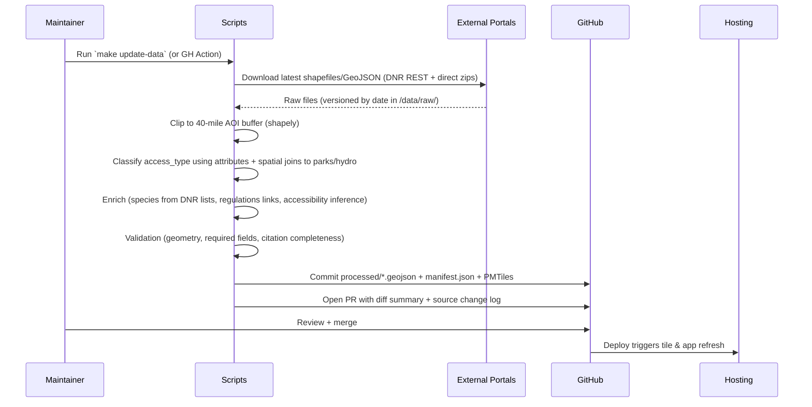

# Fishmap: Accurate Interactive Shore & Dock Fishing Map for the Grand Rapids, Michigan Area

**Author:** Grok (xAI) — Systems Architecture Design (assisted draft for project owner)  
**Date:** 2026-05-26  
**Status:** Draft  
**Version:** 1.0  
**Target Area:** 40-mile (≈64 km) radius centered on Grand Rapids, MI (approx. 42.9634°N, 85.6681°W)

---

## Overview

Fishmap is a purpose-built, mobile-first web application that answers the question “Where can I legally fish from the shore or a dock near me today?” for anglers without boats in the Grand Rapids region of Michigan’s Lower Peninsula. The app provides an authoritative, highly usable interactive map of all public water bodies (lakes, ponds, rivers, streams, and impoundments) within the 40-mile radius together with precisely attributed public shore, bank, wade, pier, dock, and road-end access points.

The solution combines authoritative public geospatial data from Michigan DNR (MiBFF boating facilities + shore fishing viewers, inland lake maps, regulations), USGS 3D Hydrography Program / NHDPlus HR extracts, Kent County / City of Grand Rapids / surrounding county GIS portals (parcels, parks, hydrography), and derived high-likelihood access polygons. A static-first JAMstack architecture using MapLibre GL JS + PMTiles delivers excellent offline performance, sub-3-second initial load on mobile networks, and zero ongoing server costs. A reproducible Python-based ETL pipeline (committed in the repo) ensures data remains traceable, citable, and updatable via pull request.

The result is a trustworthy day-trip planning tool that emphasizes shore and dock fishing, surfaces practical details (parking, hours, facilities, species, accessibility, regulations links), and includes clear provenance for every feature.

---

## Background & Motivation

Current solutions fail local shore anglers in several concrete ways:

- Michigan DNR’s primary tools (Michigan Boating Facility Finder / MiBFF at https://experience.arcgis.com/experience/cc091ec1b6a24d7a98010f8de57fd189 and the Boat Access + Shore Fishing viewer experience) are excellent statewide ArcGIS viewers but are not optimized for mobile field use, offline operation, or strict shore/dock filtering. They surface many boat-centric launches first.
- USGS and Michigan statewide hydrography layers provide accurate water polygons and flowlines but lack shore-access attribution.
- County and city open data portals (Kent County GIS at https://kentcountymi-accesskent.opendata.arcgis.com/, City of Grand Rapids GRData at https://grdata-grandrapids.opendata.arcgis.com/, Grand Valley Metro Council) publish valuable park polygons and parcels but require manual GIS work by the user to determine fishable shoreline.
- Existing consumer apps (onX Fish, Fishbrain, etc.) either emphasize boat launches, charge for detailed public-land layers, or rely heavily on user-generated content without strong citation to DNR/USGS sources.
- Paper maps, county park brochures, and the annual DNR Fishing Regulations PDF (https://www.michigan.gov/dnr/things-to-do/fishing/fishing-regulations) are authoritative but not spatially queryable or “near me” discoverable in the field.

Pain points reported by local anglers (from public forums, Experience GR guides, and DNR resources):
- Difficulty discovering lesser-known but legal riverbank access in city/county parks along the Grand River (e.g., Johnson Park’s 1.5 miles of shoreline, Fish Ladder Park at Sixth Street Dam).
- Uncertainty about legal wading access vs. private property on smaller streams and lake shores.
- Outdated or incomplete lists of road-end accesses and carry-in points suitable for shore fishing.
- No single source combining water-body accuracy + practical shore access attributes + real-time “can I get there today?” practicality (parking, hours, ADA notes).

A focused, open-source, authoritative shore-first map fills a clear local gap while remaining small enough in scope (one metro region) to maintain data quality rigorously.

---

## Goals & Non-Goals

### Goals
- Deliver a production-quality, installable PWA that works completely offline after one-time regional data download.
- Surface **only** or **primarily** confirmed or high-likelihood public shore, dock, pier, wade, bank, and road-end fishing access within the 40-mile radius.
- Every map feature carries machine-readable citations (source name, URL, retrieval date) and a human-visible “last verified” date.
- Provide fast, reliable answers on mobile in the field: geolocation → sorted list of nearest qualifying accesses + one-tap directions.
- Support quarterly (or better) authoritative data refreshes via a fully scripted, reviewable ETL process.
- Keep the project sustainable as a personal or small open-source effort (static hosting only, <$10/month if using R2 for tiles).

### Non-Goals
- Boat launch discovery or navigation as a primary feature (boat ramps may appear as secondary context or be filterable off by default).
- User-generated content as a first-class data source (optional moderated reports are a later phase).
- Statewide or national coverage.
- Real-time fishing reports, water levels, or weather (links to authoritative sources only; optional future integration).
- Native mobile apps (iOS/Android) in the initial 12 months — web PWA is the delivery vehicle.
- Paid features or accounts.
- High-resolution bathymetry rendering or 3D terrain as core (optional layer later).

---

## Proposed Design

### High-Level Architecture

```mermaid
graph TD
    subgraph "Data Sources (Authoritative)"
        DNR[MiBFF / Michigan Boating Facilities<br/>gis-midnr.opendata.arcgis.com]
        HYDRO[USGS 3DHP / NHDPlus HR +<br/>Michigan Statewide Hydrography]
        COUNTIES[Kent + Ottawa + Allegan +<br/>Ionia + Newaygo + Montcalm GIS]
        PARKS[City of GR Parks + County Parks]
    end

    subgraph "ETL Pipeline (Python + CLI)"
        RAW[download_raw.py<br/>/data/raw/]
        PROCESS[process_*.py + enrich.py<br/>Clip, classify, join, simplify]
        EXPORT[export.py → validated GeoJSON<br/>+ manifest.json]
        TILE[tippecanoe → access.pmtiles<br/>water.pmtiles]
    end

    subgraph "Frontend (JAMstack)"
        NEXT[Vite + React 18 (or current stable; React 19 when mature) + TS + Tailwind]
        MAP[MapLibre GL JS + PMTiles protocol]
        OFFLINE[maplibre-offline-pmtiles +<br/>vite-plugin-pwa + OPFS]
        SPATIAL[@turf/turf client queries]
    end

    subgraph "Hosting & Distribution"
        STATIC[Vercel / Cloudflare Pages<br/>(app + small assets)]
        R2[Cloudflare R2 / S3<br/>(PMTiles files)]
        GH[GitHub (code + data manifests)]
    end

    DNR --> RAW
    HYDRO --> RAW
    COUNTIES --> RAW
    PARKS --> RAW
    RAW --> PROCESS
    PROCESS --> EXPORT
    EXPORT --> TILE
    TILE --> STATIC & R2
    STATIC --> MAP
    R2 --> MAP
    OFFLINE --> MAP
```

### Data Pipeline (Detailed Flow)



### Core Data Products (Produced by ETL)

1. `access_points.pmtiles` (or served as vector source) — Primary layer. ~200–450 point features after filtering for shore emphasis.
2. `water_bodies.pmtiles` — Polygons for lakes/ponds + simplified flowlines for rivers/streams.
3. Supporting small GeoJSON or additional PMTiles: park boundaries used for access inference, road-end candidates.
4. `manifest.json` (versioned, machine + human readable) containing:
   - `etl_run_date`, `aoi_center`, `aoi_radius_miles`
   - Per-source: `name`, `url`, `downloaded`, `record_count`, `sha256`
   - Output statistics and known limitations.

**Example Access Point Feature (simplified GeoJSON properties after processing)**

```json
{
  "id": "midnr-bfs-482017",
  "name": "Fish Ladder Park - Grand River Shore",
  "waterbody": "Grand River (mainstem)",
  "access_type": "bank",
  "access_quality": "high",
  "lat": 42.9682,
  "lon": -85.6721,
  "parking": { "has": true, "capacity": "50+", "surface": "paved", "notes": "Large lot at 6th St Dam" },
  "facilities": ["restroom", "trash", "benches", "fish_cleaning"],
  "hours": "5:00 AM – 11:00 PM (city park rules)",
  "ada": "partial",
  "species": ["steelhead", "chinook", "smallmouth bass", "walleye", "channel catfish"],
  "regulations": {
    "summary": "Lower Grand River special muskie rules; check current regs",
    "url": "https://www.michigan.gov/dnr/-/media/Project/Websites/dnr/Documents/LED/digests/2026-Michigan-Fishing-Regulations_web_accessible.pdf"
  },
  "sources": [
    {
      "name": "Michigan Boating Facilities (MiBFF) — as of latest ETL run",
      "url": "https://gis-midnr.opendata.arcgis.com/datasets/...",
      "retrieved": "2026-05-20"
    },
    {
      "name": "City of Grand Rapids Parks",
      "url": "https://grdata-grandrapids.opendata.arcgis.com/",
      "retrieved": "2026-05-20"
    }
  ],
  "last_verified": "2026-03-15",
  "notes": "Excellent shore and wade fishing below dam. Strong current warning. Popular during salmon/steelhead runs."
}
```

### Data Acquisition Reality & Implementation Notes (Addresses Issues 1 & 3)

**Important Reality Check**: While DNR and county portals *do* expose downloadable data and REST services, full end-to-end automation of "shore access classification" is **not** a simple one-script download-and-clip operation. Significant maintainer judgment, spatial heuristics, and at least one round of manual verification per refresh are required. This subsection provides the concrete details an implementer needs.

#### Primary Source Layer Identifiers & Sample Queries (2026-verified patterns)
- **DNR Michigan Boating Facilities (MiBFF core)**: Item ID `3eaf9804bf6f4bafb8e03aea660c9fce` on gis-midnr.opendata.arcgis.com. Use the "Download" buttons for full extract or the underlying FeatureServer (inspect via ArcGIS REST directory for the live `/0/query` endpoint). Example REST pattern (Python + requests or geopandas):
  ```python
  url = "https://services.arcgis.com/.../arcgis/rest/services/.../FeatureServer/0/query"
  params = {"where": "1=1", "outFields": "*", "f": "geojson", "resultOffset": 0, "resultRecordCount": 2000}
  # Paginate; spatial filter with geometry=... for AOI bbox in Web Mercator or WGS84
  gdf = gpd.read_file(f"{url}?{urlencode(params)}")  # or POST for complex queries
  ```
- **Michigan Statewide Hydrography**: Search gis-michigan.opendata.arcgis.com for current hydro layer (often "Hydrography" or "NHD"). USGS 3DHP/ NHDPlus HR extracts via https://apps.nationalmap.gov/downloader/ (select by state/HU or bbox) or direct S3 staged products.
- **County/City Parks & Parcels**: Direct Hub downloads or REST (e.g. Kent parcels REST service). Prefer `geopandas.read_file` on published .zip or query URLs.

**Contact fallback**: For stable automation or bulk historical extracts, email DNR-GIS@Michigan.gov and county GIS offices early. Initial PRs will almost certainly involve at least one manual portal export + documented post-processing.

#### Attribute Table for Classification (Key Fields Used)
From DNR MiBFF / Boating Facilities (most relevant for shore emphasis):
- `NAME`, `OWNERSHIP` (DNR / local / federal), `TYPE` (Boat Launch / Harbor / Carry-in / etc. — many support incidental shore fishing), `RAMP_CODE` or similar, parking-related fields (spaces, surface), `RESTROOM`, `ADA_ACCESSIBLE`, `WATERBODY_NAME`, `COUNTY`, `LATITUDE`/`LONGITUDE`, `AMENITIES` (free-text or coded), `FISH_SPECIES` or notes (sometimes present), `SITEID`.

From county parks/parcels: `PARK_NAME`, `OWNER_TYPE` (public), `ACRES`, geometry (polygons), tax status flags.

Hydro layers: `FType` / `FCODE` (lake/pond/river/stream/impoundment), `GNIS_NAME`, geometry (polygons + flowlines).

#### AOI Definition (Exact, Reproducible)
Committed file: `data/aoi.geojson` (a Polygon in EPSG:4326).

Python construction (in `scripts/aoi.py` or notebook, run once and committed):
```python
from shapely.geometry import Point, shape
from shapely.ops import transform
import pyproj
from functools import partial

center = Point(-85.6681, 42.9634)  # Grand Rapids
radius_miles = 40.0
radius_m = radius_miles * 1609.344

# Project to meters for accurate buffer (Web Mercator or UTM 16N), then back to 4326
project = partial(pyproj.transform, pyproj.Proj('epsg:4326'), pyproj.Proj('epsg:3857'))
project_back = partial(pyproj.transform, pyproj.Proj('epsg:3857'), pyproj.Proj('epsg:4326'))

buffered = transform(project_back, transform(project, center).buffer(radius_m))
# Write as GeoJSON Polygon (plus optional bbox for quick pmtiles extract)
```

Use this geometry for all `gpd.clip` / `gpd.sjoin` operations. Note edge-case handling: 40-mile geodesic vs. Euclidean in projected CRS is documented in comments; the committed `aoi.geojson` is the authority.

#### Script Contracts & Pseudocode (Core Functions)
All scripts live in `/scripts/`, invoked via `python -m scripts.cli ...` or a `justfile` / Makefile. Key entry points have `--help`, produce dated outputs under `/data/raw/YYYY-MM-DD/` and `/data/processed/`, and write `manifest.json`.

**Pseudocode sketches (full implementations + unit tests expected in PR 2):**

```python
# scripts/classify.py
from shapely.geometry import Point
import geopandas as gpd

def classify_access_point(row, parks_gdf, hydro_gdf, parcels_gdf) -> dict:
    """Return access_type, access_quality, and inference flags."""
    pt = Point(row.geometry.x, row.geometry.y)
    
    # 1. Direct DNR attributes (highest confidence)
    if "shore" in str(row.get("AMENITIES", "")).lower() or row.get("TYPE") in ["Carry-in", "Fishing Pier"]:
        return {"access_type": "dock" if "pier" in ... else "bank", "access_quality": "high", "inferred": False}
    
    # 2. High-likelihood inference (core shore-first value)
    # Buffer hydro 25-50m + intersect public parks (exclude private via parcel join)
    hydro_buffer = hydro_gdf.buffer(30)  # meters, tune per water type
    if parks_gdf.sjoin(gpd.GeoDataFrame(geometry=[pt]).set_crs(4326), predicate="intersects").any():
        if not parcels_gdf.sjoin(..., predicate="contains").any():  # no private parcel contains point
            return {"access_type": "park_shore" if river else "bank", "access_quality": "medium-high", "inferred": True}
    
    # 3. Road-end / informal (from road network intersect hydro + county data)
    if road_end_candidate(pt):
        return {"access_type": "road_end", "access_quality": "medium", "inferred": True}
    
    return {"access_type": "unknown", "access_quality": "low", "inferred": False, "needs_review": True}

def infer_shore_segments(parks_gdf, hydro_gdf) -> gpd.GeoDataFrame:
    """Generate derived LineString/Polygon 'high-likelihood park shoreline' features."""
    # Buffer hydro, intersect parks, difference private parcels, simplify (tolerance 5-10m)
    ...
    return shoreline_features
```

```python
# scripts/enrich.py
def enrich_species_and_regs(access_gdf, dnr_stocking_csv, regs_pdf_map):
    # Join by waterbody name fuzzy match + county; attach static regulations links + known species lists
    # Manual overrides for high-traffic sites (Fish Ladder, etc.) stored in overrides.json
    ...
```

```python
# scripts/export.py
def validate_and_export(gdfs, manifest):
    # JSON Schema validation (see below), geometry validity (shapely.is_valid), citation presence, AOI containment
    # Write normalized GeoJSON + PMTiles-ready attributes
    ...
```

**dev environment reproducibility**: `scripts/requirements.txt` + a `Dockerfile.etl` (or devcontainer) pinning GDAL, tippecanoe (via apt or binary), Python 3.11+. GitHub Actions matrix tests the full pipeline on Linux (tippecanoe via pre-built or Docker step).

#### Required Output JSON Schema (Draft; enforced in export/validate)
Full schema committed as `docs/access-point-schema.json` (Draft 2020-12). Key required fields + types:
- `id` (string, unique), `name`, `waterbody`, `access_type` (enum: bank|dock|pier|wade|road_end|park_shore), `access_quality` (high|medium-high|medium|low), `lat`/`lon` (number), `sources` (array of objects with name/url/retrieved), `last_verified` (date).
- Optional but recommended: `parking`, `facilities` (array), `ada`, `species` (array), `regulations.url`, `notes`, `inferred` (bool), `needs_review` (bool).
- Geometry: Point (EPSG:4326).

The sample feature above (and expanded version in the schema file) is the canonical example.

#### MapLibre Layer & "Shore & Dock Only" Filter Expressions (Frontend)
In `src/components/Map.tsx` (or layer config):

```ts
// After adding sources 'access' (from access.pmtiles or GeoJSON) and 'water'
map.addLayer({
  id: 'access-points',
  type: 'symbol',
  source: 'access',
  'source-layer': 'access_points',  // or 'data' for GeoJSON
  filter: ['!=', ['get', 'access_type'], 'unknown'],
  paint: { 'icon-color': ['match', ['get', 'access_type'], 'bank', '#2e7d32', 'dock', '#1565c0', /* ... */ ] }
});

// Shore & Dock Only mode (toggled via UI state → setFilter)
const shoreDockFilter = [
  'in', ['get', 'access_type'], ['literal', ['bank', 'dock', 'pier', 'wade', 'road_end', 'park_shore']]
];
map.setFilter('access-points', shoreDockFilter);
```

Water bodies and derived shore segments use similar expressions. Boat-ramp-only points are filtered or styled with low opacity/gray by default.

#### Validation, CRS, Simplification, Citation Rules
- All geometries reprojected to EPSG:4326 on export.
- Water flowlines: simplify with 8–15 m tolerance (shapely); preserve topology where possible.
- Every feature must have ≥1 `sources[]` entry with URL + retrieval date.
- `manifest.json` records per-source record counts, SHA256 of inputs, known manual interventions, and "coverage_notes" for gaps.

Initial data PRs will contain a `DATA-VERIFICATION.md` with screenshots of portal exports + list of sites that received manual `access_quality` overrides.

This level of detail makes the ETL implementable without additional invention.

### Frontend Architecture & Key Components

- **Map View** (`src/components/Map.tsx`): MapLibre instance, PMTiles sources registered via `pmtiles.Protocol()`, custom layers for water (fill + line), access points (symbol + circle with icon mapping by `access_type`).
- **Filter & Search Drawer** (`src/components/AccessFilter.tsx`): Multi-select chips for access_type, distance slider or “Near me” (using `navigator.geolocation` + Turf), text search via Fuse.js on name + waterbody.
- **Feature Detail Panel** (bottom sheet on mobile, side panel on desktop): Rich card using the properties above + action buttons (Directions via `geo:` or Google Maps intent, Save to local “My Spots” via localStorage/Dexie, Share, Report Issue).
- **Offline Manager** (`src/lib/offline.ts`): UI to trigger regional PMTiles caching via the `maplibre-offline-pmtiles` library or custom OPFS implementation; shows downloaded regions and storage used.
- **Data Context**: React context + TanStack Query (or simple Zustand) holding the manifest and providing citation lookup.

**Critical client-side spatial logic (Turf example sketch)**

```ts
import * as turf from '@turf/turf';

function findNearestAccesses(userPoint: [number, number], maxDistanceMiles = 10) {
  // accessPoints is a pre-loaded FeatureCollection
  const pts = accessPoints.features.map(f => turf.point([f.properties.lon, f.properties.lat], f.properties));
  const user = turf.point(userPoint);
  return pts
    .map(p => ({ ...p.properties, distance: turf.distance(user, p, {units: 'miles'}) }))
    .filter(p => p.distance <= maxDistanceMiles)
    .sort((a, b) => a.distance - b.distance);
}
```

### UI/UX Principles for Rapid Shore Access Discovery

- Default map state: Centered on Grand Rapids with access points visible, water bodies lightly colored, boat ramps de-emphasized (smaller gray icons or hidden until toggled).
- Prominent “Shore & Dock Only” mode toggle that filters the layer at the source (MapLibre filter expression) and search results.
- “Today’s Practical Access” quick chips: Easy parking + short walk, ADA friendly, Riverbank in park, Known trout/steelhead water, Family friendly.
- Distance + driving-time estimates computed client-side from user location (no external routing API required initially; optional OSRM or Google later).
- Visual language: Green = confirmed high-quality bank/wade, Blue = dock/pier, Orange = road-end / informal, Purple = park shoreline segment. Hover/click highlights the associated water body.

### Offline Capabilities (Quantified)

- App shell + code: ~150–250 KB gzipped (cached by SW).
- Protomaps regional basemap extract (recommended maxzoom 12–13 for mobile practicality; see sizing note below): estimated 80–250 MB depending on exact maxzoom and vector density (conservative; real dry-runs frequently land lower for rural/suburban Michigan). Custom thematic layers (access + water): <15 MB total.
- First-time “Download Grand Rapids Region” flow: one button, progress, stored in Origin Private File System (OPFS) for persistence across sessions. The `maplibre-offline-pmtiles` library (v2+) provides quota handling, progress, and region selection patterns; see its README for OPFS eviction and background/foreground UX examples.
- After download: full pan/zoom/search/filter/detail functionality with zero network. GPS continues to work. “Directions” falls back to cached or system maps app.
- Storage quota warning + selective sub-region downloads (future).

**PMTiles Sizing & Optimization Notes (Issue 4 follow-up)**: Exact size depends on chosen `--maxzoom` (each additional level roughly doubles size in vector data). A dry-run step is **mandatory** in the first PMTiles PR:

```bash
# Example for ~40-mile radius around Grand Rapids (adjust bbox precisely via bboxfinder.com)
pmtiles extract https://build.protomaps.com/20260526.pmtiles gr-region-basemap.pmtiles \
  --bbox=-86.55,42.35,-84.85,43.55 \
  --maxzoom=13 \
  --dry-run
```

Target maxzoom decision (documented in PR 6): z13 for detailed riverbanks/road-ends in populated areas; fall back to z12 for rural outer radius if download time >10 min on typical 4G. Full z14 only for power users. These numbers are grounded in 2026 Protomaps community extracts (similar metro/rural mixes ~30–120 MB at z12–13); always validate with the CLI before committing large assets. "sub-3s initial load" refers to app shell + manifest + small fallback GeoJSON; full vector rendering is fast once tiles are local or range-requested.

**Sample AOI bbox** (used for clipping + pmtiles extract; committed as `data/aoi.geojson` in ETL PR): a 40-mile (64.37 km) geodesic buffer around 42.9634,-85.6681, approximated as the bbox above plus a precise polygon for shapely clipping (great-circle vs. Web Mercator edge handling noted in code comments).

### Hosting & Deployment

- Primary: Vercel (preview deploys on every PR).
- PMTiles: Cloudflare R2 (or Backblaze B2) with public bucket + proper CORS. Range requests are cheap and efficient.
- Data manifests and small GeoJSON fallbacks live in the repo under `/data/processed/`.

---

## API / Interface Changes

This is a greenfield project; there are no pre-existing internal APIs.

Public interface (initially none; future optional):

- Static file serving of PMTiles and `manifest.json`.
- Future phase (PR 9+): Optional lightweight Supabase Edge Functions or simple POST endpoint for “Report access update” submissions (stored with moderation queue). No public read API initially.

MapLibre sources and layers will be versioned by the data manifest. Consumers of the hosted site interact only via the UI.

---

## Data Model Changes

All data is derived. No live database.

Primary persistent artifacts:

- `/data/raw/` (git-ignored, recreated by ETL)
- `/data/processed/{access_points,water_bodies,...}.geojson` + `.pmtiles` (committed or large files referenced via Git LFS / external)
- `data/manifest.json` (committed, human + CI readable)

Migration/refresh strategy: The ETL scripts are the migration path. Each run produces a new dated snapshot. Historical manifests allow diffing and rollback by reverting a data commit.

Schema evolution is handled by adding optional fields; consumers use defensive property access.

---

## Alternatives Considered

### Alternative 1: Leaflet + Clustered GeoJSON Markers + Simple Raster Tiles (vs. MapLibre + PMTiles)

**Trade-offs:**
- **Pros**: Much simpler initial implementation, excellent popup/DOM integration, smaller initial bundle, mature react-leaflet ecosystem.
- **Cons**: Poor performance once hundreds of features + dense water polygons are on screen; no native vector styling power or smooth zoom; offline raster tiles require separate tile server or heavy pre-generation; inferior visual quality for thematic layers.
- **Decision**: Rejected for production. MapLibre + PMTiles was chosen for long-term performance, offline elegance, and modern vector capabilities on a regional dataset that will grow with derived layers (e.g., inferred park shorelines).

### Alternative 2: Full Backend (PostGIS + FastAPI/Express + Tile Server) vs. Static JAMstack

**Trade-offs:**
- **Pros of backend**: Dynamic queries (“show only waters with >X documented shore accesses”), easier user contributions, real-time updates, smaller initial client download.
- **Cons**: Ongoing hosting + DB costs, more complex deployment, single point of failure for offline use, overkill for a read-mostly authoritative dataset of this size.
- **Decision**: Rejected for v1. The static + PMTiles approach (inspired by Protomaps + Simon Willison’s regional extract patterns) meets all core requirements at near-zero marginal cost and superior offline reliability. Backend can be added later as an orthogonal enhancement (see PR Plan).

### Alternative 3: Broader Scope (Include Boat Launches Prominently + Statewide Ambition) vs. Strict Regional Shore Focus

**Trade-offs:**
- Broader scope increases appeal but dilutes the “shore angler without a boat” value proposition and dramatically increases data maintenance surface area.
- **Decision**: Strict 40-mile shore-first scope with explicit de-emphasis of boat infrastructure. This matches the user’s stated constraints exactly and keeps data quality high.

### Alternative 4: Thin Wrapper / Embed Around Existing DNR ArcGIS Experience Viewers (MiBFF + Shore Fishing Viewer)

**Trade-offs:**
- **Pros**: Zero data acquisition/ETL effort initially; immediate access to the authoritative, regularly updated DNR layers (including any shore fishing flags); familiar UI for users who already use the official tools; no hosting or rendering costs for base data.
- **Cons**: No offline/PWA capability (ArcGIS Experience Builder apps require connectivity and do not support robust region caching for field use); extremely limited control over mobile UX, filtering (cannot easily enforce "shore & dock only" as primary view or de-emphasize boat ramps), custom attribution/citations, or integration with local park data; branding and "Fishmap" identity impossible; performance and discoverability on low-end mobile devices in remote areas remain tied to the generic ArcGIS viewer; no ability to derive "high-likelihood" inferred access from park/hydro joins.
- **Decision**: Rejected. The entire motivation for Fishmap is a purpose-built, offline-first, shore-emphasized experience that the generic statewide ArcGIS viewers explicitly do not provide (as documented in Background). Embedding or wrapping would inherit all their mobile and offline shortcomings while adding negligible unique value. A thin custom client could be a future "quick win" experiment but would not satisfy the core requirements.

---

## Security & Privacy Considerations

**Threat Model**
- Primary assets: Public geospatial data + user geolocation (ephemeral).
- No user accounts in v1 → minimal attack surface.
- Risks:
  - Malicious data injection via future user reports (mitigation: GitHub-issue-only or moderated queue; server-side validation of geometry + source citation).
  - Supply-chain attacks on dependencies (mitigation: Dependabot + lockfiles + minimal deps; `npm audit` in CI).
  - Over-claiming legal access (highest severity user risk).

**Mitigations (implemented from day one)**
- Prominent, persistent disclaimer in footer + every detail panel: “Data is compiled from public sources. Always verify current conditions, property boundaries, and regulations on site. Fishmap does not grant legal access.”
- Every access point displays direct source links + retrieval dates.
- Geolocation is strictly opt-in; no background tracking.
- Content-Security-Policy (strict), no third-party analytics or trackers by default (Vercel or Plausible self-hosted optional).
- HTTPS everywhere. Static assets are immutable + hashed where practical.

**Data Handling**
- All source data is public domain or openly licensed (DNR, USGS, county open data portals).
- No PII collected or stored in v1.
- Future user reports: minimal fields (description, optional photo, location). Stored with timestamp and moderation flag.

---

## Observability

**Client-side**
- Structured console logging (dev) + optional lightweight error reporting (Sentry free tier or Vercel error tracking).
- Custom events for key flows: “map loaded”, “near_me_used”, “access_detail_opened”, “offline_download_started”.
- Offline status banner with clear user messaging.

**Data Pipeline**
- GitHub Actions workflow logs for every ETL run.
- `manifest.json` includes validation pass/fail + record counts for easy alerting via simple scripts or manual review.
- Recommended: a lightweight weekly GitHub Action that diffs the latest manifest against previous and posts a summary issue or Slack/Discord notification.

**Hosting**
- Vercel / Cloudflare analytics for page views and Core Web Vitals (no user-level tracking).
- R2 bucket access logs (cheap, optional) for tile request patterns to inform future zoom-level or region optimizations.

**Alerting Targets (MVP)**
- Broken map load (Sentry)
- ETL validation failure (GitHub Action failure + issue)
- Data staleness > 6 months (simple calendar reminder + manifest date check)

---

## Rollout Plan

1. **Internal / Local Only (PRs 1–2)**: Developer machine only. Sample data with full provenance + first runnable map (PR 2).
2. **Private Alpha (PR 3)**: Share unlisted Vercel preview URL with 5–10 trusted local anglers. Collect qualitative feedback on data gaps and UX friction. Data still limited.
3. **Closed Beta (PRs 5–6)**: Public but unadvertised GitHub repo + preview URL. Invite via local fishing Facebook groups / Reddit r/grandrapids and r/MichiganFishing. Require explicit “I understand data is in progress” acknowledgement. Full offline PWA + expanded dataset.
4. **Public Launch (PR 7)**: Announce on relevant forums, local bait shops, DNR contacts for feedback. Polished production site, full 40-mile dataset, automation for future updates.
5. **Data Update Cadence**: Quarterly PRs by maintainer or contributors. Each data PR must include:
   - Updated `manifest.json`
   - Human-readable `CHANGELOG-data.md` entry
   - Before/after statistics
   - Any manual curation notes

**Rollback Strategy**
- Data rollback = revert the data commit + redeploy (instant on static host).
- Code rollback = Vercel instant revert or Git revert + deploy.
- Feature flag pattern (simple `import.meta.env.VITE_ENABLE_*`) used for any risky new UI or layer from the start.

**Success Metrics (first 6 months)**
- 1,000+ unique monthly users
- Average session duration > 4 minutes
- >60% of users trigger “near me” or save a spot
- At least one successful quarterly data refresh PR from a non-maintainer

---

## Open Questions

1. **Surrounding County Coverage Depth**: How thoroughly should we pursue park and road-end data from Ottawa, Allegan, Ionia, Newaygo, and Montcalm counties? (Current plan prioritizes Kent + immediate adjacent per the Data Sources Inventory table; others on best-effort basis with explicit gap documentation in manifest.json. See also ETL Reality subsection.)
2. **Community Contribution Model**: Should v2 include a “Suggest new access point” flow that creates a pre-filled GitHub issue with GeoJSON? Or require photo + description for moderation?
3. **Bathymetry & Structure Layers**: DNR publishes many inland lake contour maps. Worth the ETL effort and visual complexity for v1?
4. **Fishing Report / Conditions Integration**: Simple links vs. embedding weekly DNR reports or RSS? Privacy and freshness concerns.
5. **Legal / Liability Language**: Exact disclaimer wording — should we consult a Michigan attorney familiar with recreational use statutes (e.g., Recreational Trespass Act implications)?
6. **Performance Budget**: Target PMTiles size for comfortable mobile download on 4G? (Current estimate 150–400 MB for full region.)

---

## References

- Michigan DNR GIS Open Data: https://gis-midnr.opendata.arcgis.com/
- Michigan Boating Facility Finder (MiBFF): https://experience.arcgis.com/experience/cc091ec1b6a24d7a98010f8de57fd189
- Boat Access and Shore Fishing resources / DNR “Where to Fish”: https://www.michigan.gov/dnr/things-to-do/fishing/where
- 2026 Michigan Fishing Regulations (PDF): https://www.michigan.gov/dnr/things-to-do/fishing/fishing-regulations
- Kent County GIS Open Data Portal: https://kentcountymi-accesskent.opendata.arcgis.com/
- City of Grand Rapids GRData: https://grdata-grandrapids.opendata.arcgis.com/
- USGS National Hydrography / 3DHP access: https://www.usgs.gov/national-hydrography/access-national-hydrography-products
- Protomaps + PMTiles documentation & MapLibre examples: https://protomaps.com/ and https://docs.protomaps.com/pmtiles/maplibre
- MapLibre GL JS: https://maplibre.org/maplibre-gl-js/docs/
- Simon Willison’s PMTiles regional static map pattern (highly influential): https://til.simonwillison.net/gis/pmtiles
- Turf.js spatial library: https://turfjs.org/

### Data Sources Inventory (Primary + Secondary)

All sources are public/open-data portals using ArcGIS Hub or REST patterns. Automation prefers direct download buttons, published FeatureServer REST `/query?f=geojson` (with pagination + where clauses for AOI), or stable export URLs over scraping Hub landing pages (which are JS-heavy and brittle, as confirmed during research).

| Source | Primary Layer / Dataset | Access Method (preferred) | Notes / Known Gaps for Shore Access | Portal URL |
|--------|-------------------------|---------------------------|-------------------------------------|------------|
| Michigan DNR (MiBFF) | Michigan Boating Facilities (item 3eaf9804bf6f4bafb8e03aea660c9fce) | Direct GeoJSON/shapefile download or ArcGIS REST FeatureServer query | Primary authoritative access points; includes TYPE, OWNERSHIP, amenities, some shore/pier indicators. Boat-ramp heavy; requires classification. | https://gis-midnr.opendata.arcgis.com/maps/3eaf9804bf6f4bafb8e03aea660c9fce |
| Michigan Statewide Hydrography | State hydro (lakes/rivers/streams) + NHDPlus HR / 3DHP extracts | Direct downloads (state portal or USGS National Map / S3) | Excellent water polygons/flowlines for "high-likelihood" inference via park/hydro buffers. | https://gis-michigan.opendata.arcgis.com/ + USGS 3DHP |
| Kent County | Parcels, Parks, Hydro, Recreation layers | ArcGIS Hub direct downloads + REST | Good parks + parcels for excluding private land and inferring shoreline access. | https://kentcountymi-accesskent.opendata.arcgis.com/ |
| City of Grand Rapids | All Grand Rapids Parks (polygons) | GRData Hub downloads/REST | Critical for Grand River bank access (e.g. Johnson Park, Fish Ladder). | https://grdata-grandrapids.opendata.arcgis.com/ |
| Surrounding Counties (Ottawa, Allegan, Ionia, Newaygo, Montcalm) | Parks, parcels, local hydro (varies) | County GIS portals / ArcGIS Hub (best-effort) | Variable completeness. Prioritize Ottawa/Allegan for southern/western radius; gaps expected in rural road-end data. Manual verification higher. | Search "[County] MI GIS open data" + Grand Valley Metro Council (GVMC) |

**Automation Note**: Scripts will target stable REST endpoints or published download URLs (e.g. `geopandas.read_file("https://.../query?where=...&outFields=*&f=geojson")` or direct .zip). Hub page scraping is avoided. Initial runs may require one-time manual export from the DNR portal if stable permalinks shift; contact DNR-GIS@Michigan.gov for guidance on automation-friendly feeds.

---

## Key Decisions

1. **Static-first JAMstack + MapLibre + PMTiles over any server-backed GIS stack** — Chosen for zero hosting cost at scale, superior offline experience critical for field use, and dramatically simpler maintenance for a small team or solo maintainer. Matches proven patterns from Protomaps and regional OSM extract projects.

2. **Strict 40-mile regional scope with shore/dock primary emphasis** — Directly implements the user’s explicit requirements. Prevents scope creep and keeps data quality and citation burden manageable. Boat infrastructure is intentionally secondary.

3. **Python + GDAL/geopandas ETL scripts committed in-repo as the single source of truth for data** — Enables fully reproducible, auditable updates via PR. No external paid ETL tools or opaque SaaS processes. Manifest + Git history provides complete provenance.

4. **PMTiles (custom overlays + Protomaps regional base) for both basemap and thematic layers** — Enables efficient range-request static hosting, excellent vector performance, and first-class offline caching via OPFS. Far superior to raster tiles or large client-side GeoJSON for this use case.

5. **No user accounts or real-time backend in v1** — Minimizes security/privacy surface and operational burden. All core value is delivered statically. Future contributions gated behind GitHub issues or a later moderated layer.

6. **Citations and disclaimers as first-class UI elements on every feature** — Non-negotiable for authoritative data use. Reduces legal risk and builds user trust. Implemented in the core data model and detail panel from the earliest PRs.

7. **PWA + service worker + offline PMTiles region download as a day-one feature** — Directly addresses the mobile “in the field” requirement. Users must be able to use the map with airplane mode after a single preparation step.

8. **Incremental PR plan with independently valuable slices** — Each PR adds either working software or reviewable data artifacts. Allows early feedback, parallel contribution, and safe rollback.

---

## PR Plan

The following is a realistic, ordered sequence of independently reviewable and mergeable pull requests for a greenfield solo or small part-time effort. Each PR delivers a concrete, demonstrable artifact (runnable code, validated data snapshot, or working UI slice) that provides standalone value and can be reviewed/merged without the full stack. 

**Consolidated to 8 PRs** (down from 11) to reduce overhead while preserving incremental progress. **Estimated timeline: 6–9 months part-time** (accounting for real-world ETL classification effort, tippecanoe reproducibility in CI, manual data verification, device testing for PWA/OPFS, and LFS/R2 asset decisions). PRs 1–2 can have limited safe parallelism after initial setup. Data-heavy PRs assume 1–2 weeks of focused classification + verification per major refresh.

Key foundational elements added early:
- `.github/workflows/ci.yml` (lint, test, ETL validation, dry-run tippecanoe build) owned in PR 1.
- Explicit decision record + script for LFS vs. external R2 hosting of large PMTiles (in PR 4).
- Reproducible ETL dev environment (Dockerfile.etl + justfile targets for tippecanoe + GDAL).
- `data/aoi.geojson` + full schema + pseudocode implementations (per ETL Reality subsection).

### PR 1: Repository Bootstrap + CI + Reproducible ETL Dev Environment + Initial Data Skeletons + Sample Provenance Data
- **Files/Components**: Full repo skeleton (gitignore, LICENSE, README with design doc link, CONTRIBUTING), `.github/workflows/ci.yml` (Python lint + schema validation + sample ETL run), `scripts/` (download_raw.py skeleton, classify.py + enrich.py with pseudocode from ETL Reality subsection implemented for 3 hand-curated sites, aoi.py + committed `data/aoi.geojson`, requirements + Dockerfile.etl, justfile/Makefile targets), `docs/ETL-SPEC.md` (initial contracts + JSON Schema draft), tiny but fully attributed sample dataset (3–5 real sites including Fish Ladder Park + Johnson Park with manifest.json, sources, last_verified, and DATA-VERIFICATION.md notes).
- **Dependencies on other PRs**: None.
- **Independently valuable deliverable**: A `make etl-sample` (or equivalent) that runs locally in the Docker env, produces a validated `manifest.json` + GeoJSON conforming to schema, and passes CI on push. First real (if tiny) authoritative data artifact with full provenance. Enables all later data work.

### PR 2: First Usable Interactive Map (Hardcoded → Real Sample Data + Basic Filtering/Search)
- **Files/Components**: Vite + React 18 + TS + Tailwind + MapLibre scaffold, `src/components/Map.tsx` + basic layers, client-side filters (access_type chips, "Shore & Dock Only" toggle using the MapLibre filter expressions from ETL Reality), Fuse.js search, Geolocation + Turf "Near me" (sorted list + highlight), simple detail popup/panel, responsive shell. Wire real processed sample GeoJSON from PR 1 (no more hardcoded after integration).
- **Dependencies**: PR 1 (can begin basic map work in parallel once skeleton lands).
- **Independently valuable deliverable**: A working local `npm run dev` map centered on Grand Rapids that loads the PR 1 sample data, supports "near me" (with browser permission) + filters, and displays basic details + source citations. First end-to-end runnable prototype.

### PR 3: Rich Detail Panels, Citations, Regulations, and Saved Spots
- **Files/Components**: Production-grade feature detail (mobile bottom sheet + desktop side panel) with full parking/facilities/ADA/species/regulations links (clickable), prominent disclaimers + source citations, "Get Directions" intents, local "My Saved Spots" (localStorage + Dexie), share buttons, basic error/loading states.
- **Dependencies**: PR 2.
- **Independently valuable deliverable**: Clicking any access point now answers the core user question with practical, citable details. Ready for alpha user testing of the "practical details" experience.

### PR 4: PMTiles Generation + Protomaps Basemap Integration + Asset Hosting Decision
- **Files/Components**: `scripts/tile.py` (tippecanoe wrapper), updated ETL export to emit PMTiles-ready GeoJSON + small thematic PMTiles, MapLibre integration of Protomaps regional extract + custom layers (with dry-run `pmtiles extract --dry-run --bbox=...` using the AOI from PR 1; results + maxzoom rationale committed), removal of large client-side GeoJSON. Explicit decision record (`docs/ASSET-HOSTING.md`) comparing Git LFS vs. Cloudflare R2 (or equivalent) for PMTiles + CORS setup notes. CI step that builds small test PMTiles.
- **Dependencies**: PR 1, PR 2.
- **Independently valuable deliverable**: The map now renders from efficient vector tiles (basemap + custom). First production-grade data delivery mechanism + documented hosting strategy for large assets. Major performance milestone.

### PR 5: Full PWA + Offline Region Download + Quota Handling
- **Files/Components**: `vite-plugin-pwa` (manifest + SW), full integration of `maplibre-offline-pmtiles` (or equivalent) with "Download Grand Rapids Region" UI, progress, OPFS storage management + quota warnings, offline status banner + graceful degradation, install prompt. Test matrix notes for real mobile devices.
- **Dependencies**: PR 4.
- **Independently valuable deliverable**: After one download, the entire app (map + search + details) works completely offline on airplane mode. Directly fulfills the "mobile in the field" requirement. Demoable on a phone with no cell service.

### PR 6: Expanded County Coverage, Enhanced Shore Classification, Polish, and Full 40-Mile Dataset
- **Files/Components**: Expand ETL (PR 1 scripts) to surrounding counties per Data Sources Inventory (best-effort Ottawa/Allegan first), full implementation + manual verification of `classify_access` / `infer_shore_segments` heuristics (park/hydro buffers, private parcel exclusion, road-end detection), richer species/regulations enrichment, layer toggles + legend + accessibility audit, visual + mobile polish, error states, loading skeletons, updated manifest with coverage notes + known gaps.
- **Dependencies**: PR 1, PR 5.
- **Independently valuable deliverable**: Production-quality dataset for the full 40-mile radius with documented shore-first classification logic and explicit gap tracking. The map now feels complete for day-trip planning.

### PR 7: Production Deployment, Observability, Legal Disclaimers, Launch Prep, and Sustainment Automation
- **Files/Components**: Vercel (or Cloudflare Pages) config + preview deploys, production R2 bucket + CORS for PMTiles (per PR 4 decision), strict CSP + prominent disclaimers everywhere (UI + README + every feature), basic privacy-respecting analytics, GitHub issue templates for data reports, first public announcement checklist, comprehensive `/docs/` (ETL runbook with exact portal steps + verification checklist, full schema, contribution guide), GitHub Action for ETL dry-runs + manifest diff + draft data PR scaffolding, `CHANGELOG.md` + data update cadence docs.
- **Dependencies**: PR 6.
- **Independently valuable deliverable**: A publicly accessible, production-hardened site (even if unadvertised initially) with full observability, legal hygiene, and automation for future quarterly refreshes. Ready for controlled beta → public launch.

### PR 8 (Future / Optional, Post-Launch): Moderated User Report Ingestion
- **Files/Components**: Optional lightweight Supabase (or GitHub Issues + Action) flow for "Report update / suggest access" that creates pre-filled, geometry-validated issues. Moderation queue + display of community notes (clearly distinguished from authoritative data).
- **Dependencies**: PR 7.
- **Independently valuable deliverable**: First controlled channel for community augmentation while preserving the authoritative core.

**Rollout alignment** (updated for consolidated plan): Internal (PR 1–2), Private Alpha (PR 3), Closed Beta (PR 5–6), Public Launch (PR 7). Data updates remain quarterly PR-driven.

---

**End of Design Document**